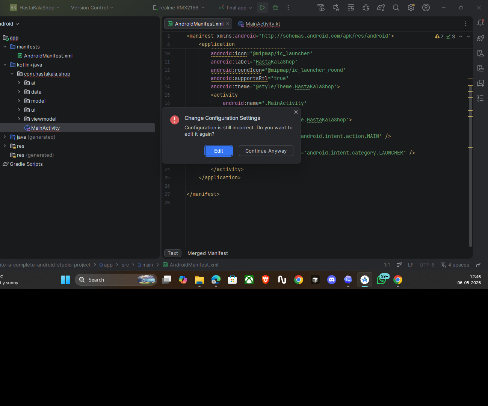
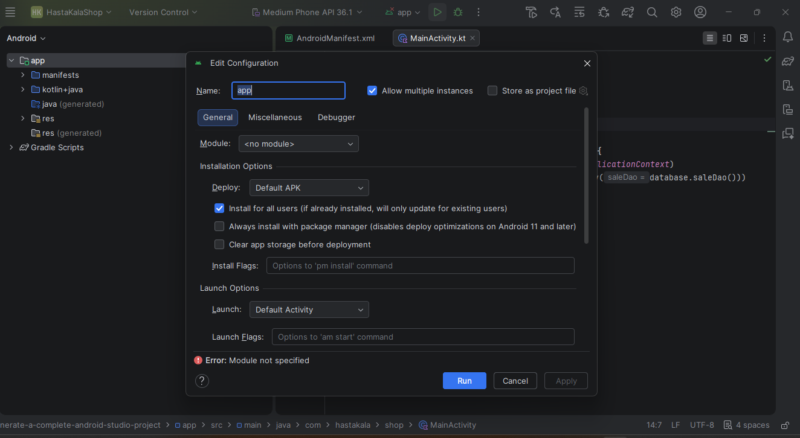
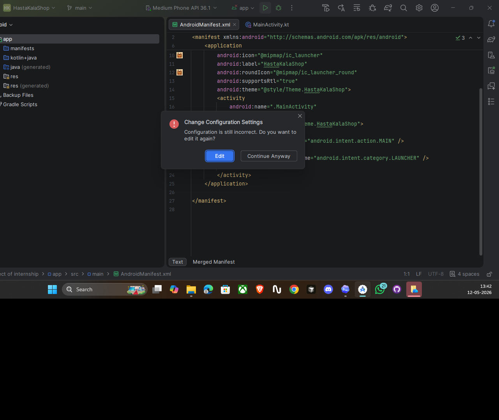

# HastaKalaShop

HastaKalaShop is a native Android Studio project built with Kotlin, Jetpack Compose, Room, and MPAndroidChart.

## Features

- Splash screen with app branding
- Dashboard with sales summaries
- Quick sale entry screen
- Best seller analysis with charts
- Income log with filters
- Local Room database storage
- Mock recommendation insight generator

## Tech Stack

- Kotlin
- Jetpack Compose Material 3
- MVVM architecture
- Room Database
- MPAndroidChart
- Firebase Firestore placeholder sync support

## Minimum SDK

- Android 8.0 (API 26)

## Project Structure

- `app/` Android application module
- `app/src/main/java/com/hastakala/shop/` app source
- `app/src/main/res/` resources and launcher assets

## Screenshots

