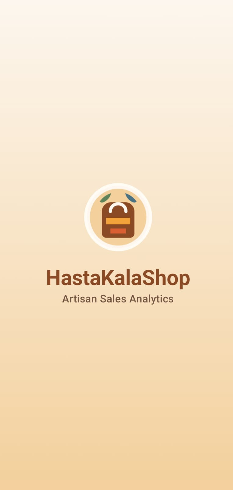
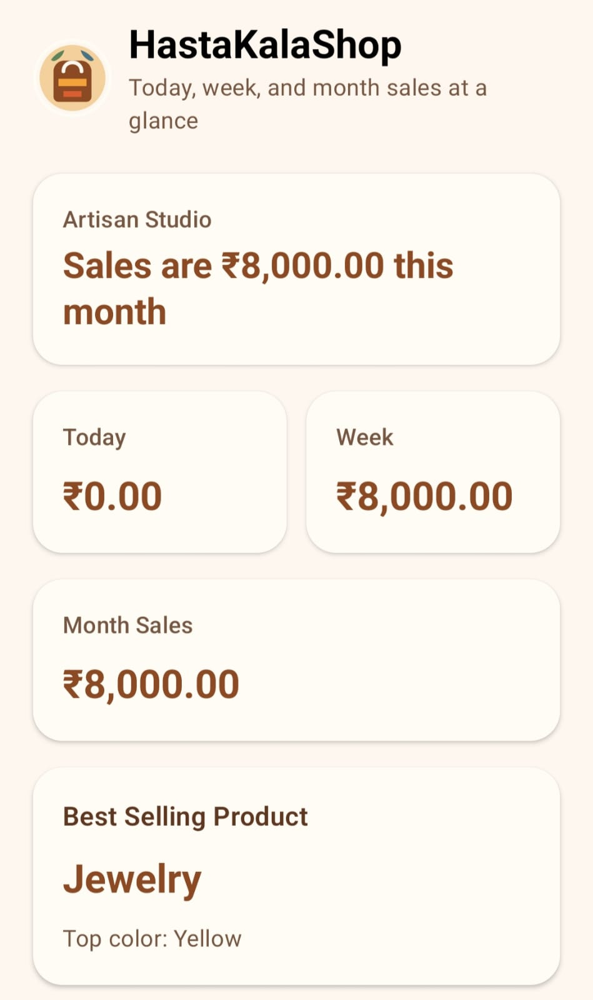
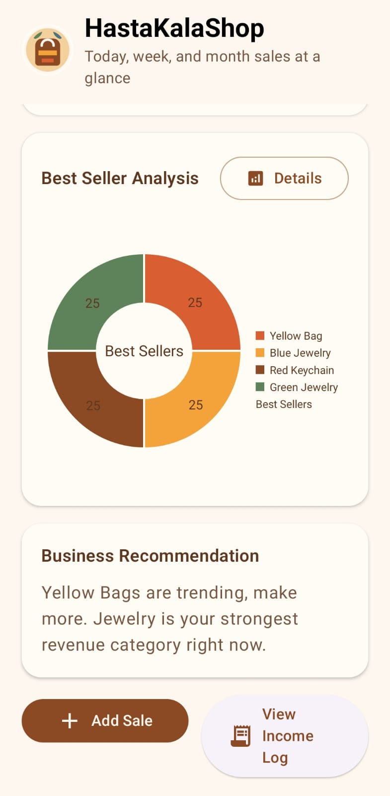
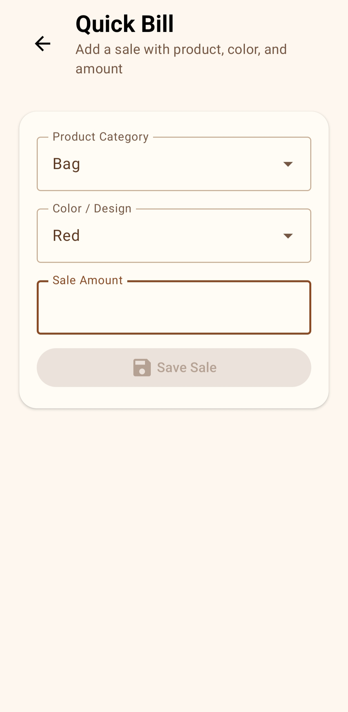
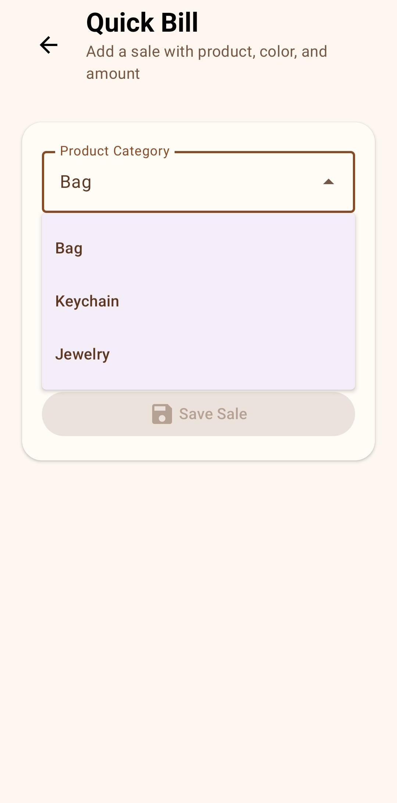
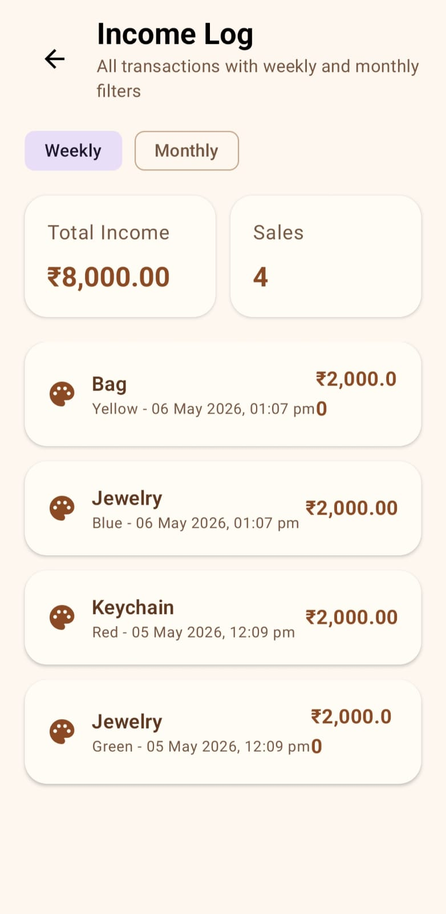
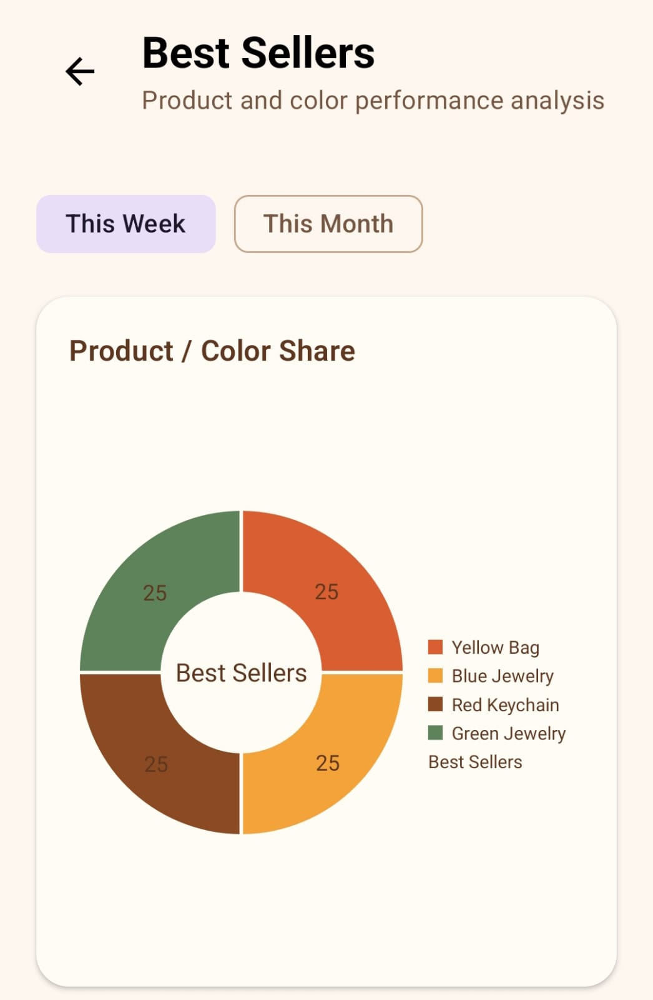
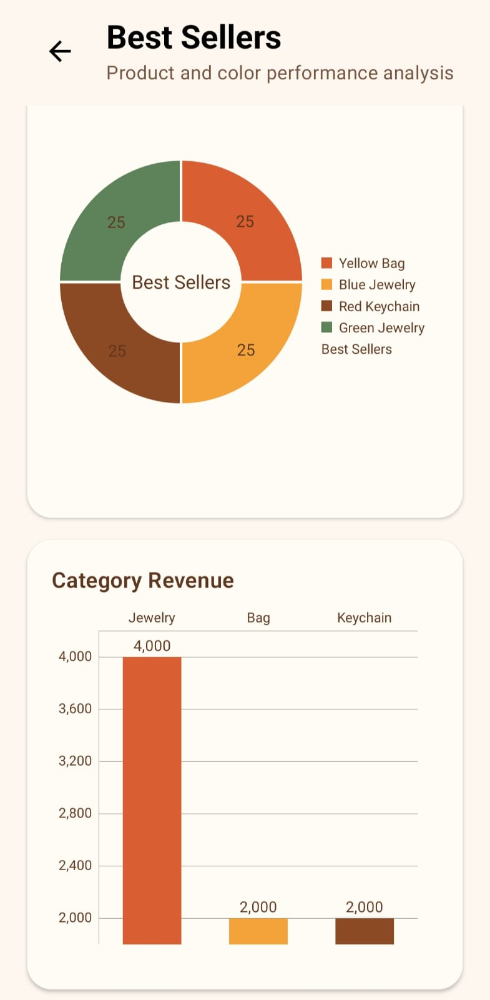

# HastaKalaShop

HastaKalaShop is a native Android Studio project built with Kotlin, Jetpack Compose, Room, and MPAndroidChart.
-Hasta Kala is a modern Android application developed using Android Studio for exploring and purchasing handmade crafts and traditional    products. The app provides a clean and user-friendly interface where users can browse different categories, view product details, and     explore handcrafted items easily. The main aim of the project is to support local artisans by creating a digital platform for showcasing  and selling handmade products. The project focuses on simple navigation, attractive UI design, and a smooth user experience.

## Features

- Splash screen with app branding
- Dashboard with sales summaries
- Quick sale entry screen
- Best seller analysis with charts
- Income log with filters
- Local Room database storage
- Mock recommendation insight generator

## Tech Stack

- Kotlin
- Jetpack Compose Material 3
- MVVM architecture
- Room Database
- MPAndroidChart
- Firebase Firestore placeholder sync support

## Minimum SDK

- Android 8.0 (API 26)

## Project Structure

- `app/` Android application module
- `app/src/main/java/com/hastakala/shop/` app source
- `app/src/main/res/` resources and launcher assets
APK-https://drive.google.com/file/d/1Zva__R4bU0e4590ngP7qlinyTHp6KHAb/view?usp=sharing

## Screenshots

